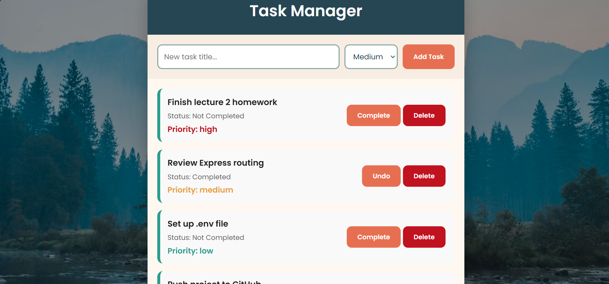

# Task Manager REST API

A simple **Task Manager REST API** built with **Node.js**, **Express.js**, and the **MVC architecture**.

## Features

- Full CRUD operations
- MVC structure (Routes → Controllers → Services → Data)
- Environment variables with `.env`
- CORS enabled
- Simple frontend for viewing and adding tasks

## Project Structure

task-manager-api/
├── backend/
│ ├── config/
│ ├── controllers/
│ ├── routes/
│ ├── services/
│ ├── data/
│ ├── index.js
│ ├── package.json
│ └── .env
├── frontend/
│ ├── index.html
│ ├── style.css
│ └── app.js
└── README.md

## Technologies Used

- Node.js
- Express.js
- CORS
- dotenv
- HTML
- CSS
- JavaScript

## Setup Instructions

### 1. Clone the repository

```bash
git clone https://github.com/emu-1803/Task-Manager-API.git
```

### 2. Go to the project folder

```bash
cd Task-Manager-API
```

### 3. Install backend dependencies

```bash
cd backend
npm install
```

### 4. Create a `.env` file

PORT=5000
APP_NAME=Task Manager API

### 5. Run the server

```bash
npm run dev
```

Server will run at:

http://localhost:5000

## API Endpoints

### Get all tasks

```http
GET /api/tasks
```

### Get a task by ID

```http
GET /api/tasks/:id
```

### Create a task

```http
POST /api/tasks
```

Request body:

```json
{
  "title": "Learn Express",
  "priority": "high"
}
```

### Update a task

```http
PATCH /api/tasks/:id
```

Example:

```json
{
  "completed": true
}
```

### Delete a task

```http
DELETE /api/tasks/:id
```

---

## Frontend

Open `frontend/index.html` using **Live Server** or any browser.

The frontend supports:

- Viewing tasks
- Adding new tasks
- Deleting Tasks
- mark as completed

## Sample Task Object

```json
{
  "id": 1,
  "title": "Finish lecture 2 homework",
  "completed": false,
  "priority": "high"
}
```

## Learning Objectives

This project demonstrates:

- REST API design
- Express routing
- Middleware usage
- MVC architecture
- CRUD operations
- Frontend ↔ Backend communication

## Screenshots



## Author

**Eman Mohammed**

GitHub: https://github.com/emu-1803
